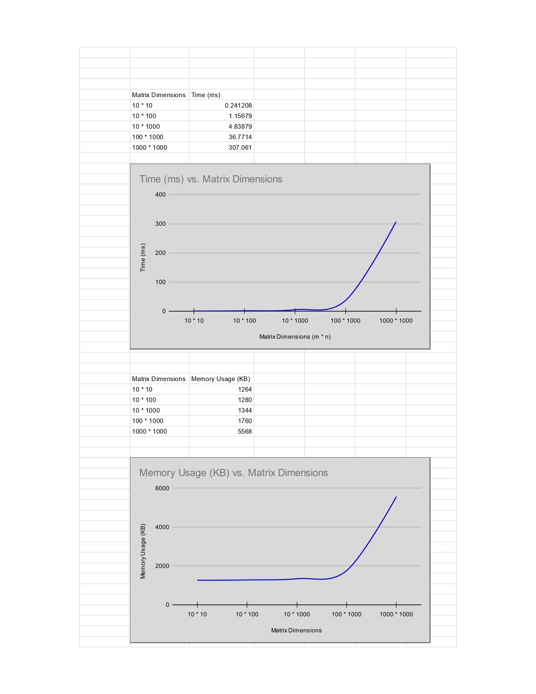

# Assignment 2 Report

## Problem 1: Weighted approximate common substring

### Problem Overview
Given two strings $a = a_1a_2...a_m$ and $b = b_1b_2...b_n$, where each character $a_i$ has an associated weight $w_i$, and a mismatch penalty $\delta$, find the common substring with the maximum score. Matching characters contribute their weight, while mismatches incur a penalty.


### Dynamic Programming Formulation

#### State Definition
$$OPT(i,j) = \text{Maximum score of any substring ending at position } a_i \text{ in string } a \text{ and } b_j \text{ in string } b$$

**Key Insight:** There is inherent similarity to Kadane's algorithm for maximum subarray sum.

#### Optimization Goal
$$\text{Answer} = \max_{1 \le i \le m, \, 1 \le j \le n} OPT(i,j)$$

We seek the maximum value across all entries in the DP table, which represents the best scoring common substring.

#### Bellman Equation
Assuming 1 based indexing of the two strings;

$$
OPT(i, j) =
\begin{cases}
0, & \text{if } i = 0 \text{ or } j = 0, \\[8pt]
w_i + OPT(i-1, j - 1), & \text{if } a_i = b_j, \\[8pt]
\max\!\bigl(OPT(i-1, j - 1) - \delta,\; 0\bigr), & \text{if } a_i \neq b_j
\end{cases}
$$

#### Correctness Justification

**Base Case:** When $i = 0$ or $j = 0$, we have exhausted one of the strings, so no substring can be formed. Thus $OPT(0, j) = OPT(i, 0) = 0$ for all $i, j$.

**Case 1 - Match ($a_i = b_j$):**
- When characters match, we extend the substring ending at $(i-1, j-1)$ by including the matching pair
- We gain the weight $w_i$ associated with this character
- The score becomes $w_i + OPT(i-1, j-1)$
- **Optimal Substructure:** The best substring ending at $(i,j)$ with a match must be built upon the best substring ending at $(i-1, j-1)$

**Case 2 - Mismatch ($a_i \neq b_j$):**
- We can extend the substring from $(i-1, j-1)$ and pay the penalty $\delta$, giving score $OPT(i-1, j-1) - \delta$
- Alternatively, we can start a new substring at this position with score 0
- We take the maximum: $\max(OPT(i-1, j-1) - \delta, 0)$
- **Key Observation:** This allows negative-scoring segments to be discarded, ensuring we only track locally optimal alignments

**Optimal Substructure Property:**
The optimal solution to subproblem $OPT(i,j)$ depends only on the solution to subproblem $OPT(i-1, j-1)$. Each substring ending at $(i,j)$ is constructed by either:
1. Extending the best substring ending at $(i-1, j-1)$ (if beneficial), or
2. Starting fresh at $(i,j)$

**Overlapping Subproblems:**
The value $OPT(i-1, j-1)$ may be computed multiple times in a naive recursive solution. The DP table eliminates redundant computation by storing each subproblem result exactly once.

### Solution Extraction

#### Finding the Optimal Score
1. Compute all entries $OPT(i,j)$ for $1 \le i \le m$ and $1 \le j \le n$
2. Track the maximum value: $\text{max\_score} = \max_{i,j} OPT(i,j)$
3. Record the indices $(i^*, j^*)$ where this maximum occurs

#### Reconstructing the Optimal Substring (Backtracking)
Starting from the position $(i^*, j^*)$ where the maximum score was achieved:

1. **Initialize:** Set $i = i^*$, $j = j^*$, and create an empty result string
2. **Backtrack:** While $OPT(i,j) > 0$:
   - Append character $a_i$ to the result string
   - Move to the previous position: $i \leftarrow i-1$, $j \leftarrow j-1$
3. **Termination:** Stop when $OPT(i,j) = 0$ (start of the optimal substring)
4. **Reverse:** Since we built the string backwards, reverse it to get the actual substring

#### Pseudo Code

```
string ans = "";
int i = i*, j = j*;
while(opt[i][j] > 0)
{
    ans.push_back(a[i]);
    i--;
    j--;
}
reverse(ans.begin(),ans.end());
```

### Complexity Analysis

#### Time Complexity: $O(m \cdot n)$

**Justification:**
- **Number of Subproblems:** There are $(m+1) \times (n+1)$ entries in the DP table
- **Time per Subproblem:** Each entry $OPT(i,j)$ requires $O(1)$ operations:
  - One character comparison: $a_i = b_j$
  - Constant arithmetic operations (addition, max)
- **Total Computation Time:** $O(m \cdot n) \times O(1) = O(m \cdot n)$
- **Solution Extraction:** Backtracking takes $O(\min(m,n))$ in the worst case (length of the substring), which is dominated by the table computation

**Overall:** $O(m \cdot n)$

#### Space Complexity: $O(m \cdot n)$

**Justification:**
- **DP Table Storage:** We maintain a 2D table of size $(m+1) \times (n+1)$ to store all $OPT(i,j)$ values
- **Auxiliary Space:** $O(1)$ for tracking maximum value and indices
- **Total Space:** $O(m \cdot n)$

### Common Substring Analysis Results

The analysis compares the following two input strings:

* **String a**: `"ABCAABCAA"`
* **String b**: `"ABBCAACCBBBBBB"`

The scoring mechanism is based on the match weight ($w_l$) and the mismatch penalty ($\delta$). The score is calculated as: $\text{Score} = \left(\sum w_l \times \text{Matches}\right) - (\delta \times \text{Mismatches})$.

---

###  Detailed Results Table

The match counts (A/B/C) refer to the number of times those letters appear in the **Best Common Substring**.

| $w_l$ (Match Weight) | $\delta$ (Mismatch Penalty) | Best Common Substring | Score | Matches (A/B/C) | Mismatches |
| :--- | :--- | :--- | :--- | :--- | :--- |
| $\mathbf{1}$ | $\mathbf{10}$ | `BCAA` | **4.0000** | 2 / 1 / 1 | 0 |
| Freq. of Letter | $5.80398$ | `ABCAABCAA` | **22.7560** | 4 / 1 / 1 | 3 |
| Freq. of Letter | $11.9731$ | `BCAA` | **20.4400** | 2 / 1 / 1 | 0 |
| Freq. of Letter | $11.2369$ | `BCAA` | **20.4400** | 2 / 1 / 1 | 0 |
| Freq. of Letter | $11.9383$ | `BCAA` | **20.4400** | 2 / 1 / 1 | 0 |
| Freq. of Letter | $9.09142$ | `BCAA` | **20.4400** | 2 / 1 / 1 | 0 |
| Freq. of Letter | $\mathbf{0.245124}$ | `AABCAA` | **28.3149** | 3 / 1 / 1 | 1 |
| Freq. of Letter | $3.90712$ | `AABCAA` | **24.6529** | 3 / 1 / 1 | 1 |
| Freq. of Letter | $9.83778$ | `BCAA` | **20.4400** | 2 / 1 / 1 | 0 |
| Freq. of Letter | $5.3316$ | `ABCAABCAA` | **23.2284** | 4 / 1 / 1 | 3 |
| Freq. of Letter | $3.02249$ | `AABCAA` | **25.5375** | 3 / 1 / 1 | 1 |

---

###  Summary of Substrings

The analysis yielded three distinct "Best Common Substrings" depending on the penalty ($\delta$):

1.  **`BCAA`**: The highest-scoring result when the mismatch penalty ($\delta$) is **very high**, as it has **0 mismatches**.
2.  **`AABCAA`**: The highest-scoring result for an **intermediate** range of $\delta$, offering a high match count for only **1 mismatch**.
3.  **`ABCAABCAA`**: The highest-scoring result when the mismatch penalty is **very low**, as it maximizes the match score but incurs **3 mismatches**.

-----

The analysis now compares the following two input strings:

* **String a**: `"ABCDEGHZIHJKLKKLKL"`
* **String b**: `"EFGHIJJKLKLLKKLLZ"`

The scoring mechanism is based on the match weight ($w_l$) and the mismatch penalty ($\delta$). The score is calculated as: $\text{Score} = \left(\sum w_l \times \text{Matches}\right) - (\delta \times \text{Mismatches})$.

---

### Detailed Results Table

The match counts refer to the number of times those letters appear in the **Best Common Substring**. For brevity, only letters that appear in a match (E, I, J, K, L) are listed.

| $w_l$ (Match Weight) | $\delta$ (Mismatch Penalty) | Best Common Substring | Score | Matches (E/I/J/K/L) | Mismatches |
| :--- | :--- | :--- | :--- | :--- | :--- |
| $\mathbf{1}$ | $\mathbf{10}$ | `JKLK` | **4.0000** | 0 / 0 / 1 / 2 / 1 | 0 |
| Freq. of Letter | $7.31791$ | `E` | **12.0200** | 1 / 0 / 0 / 0 / 0 | 0 |
| Freq. of Letter | $11.1879$ | `E` | **12.0200** | 1 / 0 / 0 / 0 / 0 | 0 |
| Freq. of Letter | $4.38296$ | `E` | **12.0200** | 1 / 0 / 0 / 0 / 0 | 0 |
| Freq. of Letter | $3.71391$ | `E` | **12.0200** | 1 / 0 / 0 / 0 / 0 | 0 |
| Freq. of Letter | $4.95628$ | `E` | **12.0200** | 1 / 0 / 0 / 0 / 0 | 0 |
| Freq. of Letter | $3.5106$ | `E` | **12.0200** | 1 / 0 / 0 / 0 / 0 | 0 |
| Freq. of Letter | $2.45134$ | `EGHZIHJKLKKLK` | **17.2033** | 1 / 1 / 1 / 3 / 2 | 5 |
| Freq. of Letter | $5.26614$ | `E` | **12.0200** | 1 / 0 / 0 / 0 / 0 | 0 |
| Freq. of Letter | $\mathbf{0.377216}$ | `EGHZIHJKLKKLK` | **27.5739** | 1 / 1 / 1 / 3 / 2 | 5 |
| Freq. of Letter | $11.0693$ | `E` | **12.0200** | 1 / 0 / 0 / 0 / 0 | 0 |

---

###  Summary of substrings

This dataset demonstrates a strong preference for the single-character match **`E`** across most $\delta$ values due to the high penalty of mismatches versus the gain from extra match weight.

1.  **High Match Score (Low Penalty):** The longest match, **`EGHZIHJKLKKLK`**, is optimal when $\delta$ is very low ($\leq 2.45134$), accepting **5 mismatches** for the highest total score.
2.  **Perfect Match Score (High Penalty):** When $\delta$ is high, the optimal match is the shortest perfect match, **`E`**, with **0 mismatches** and a score equal to the frequency weight of 'E' ($12.02$).

---

## Problem 2: Largest zero sub-matrix

### Problem Overview
Given an $m \times n$ boolean matrix $B$ where entries are either 0 or 1, find the largest square submatrix consisting entirely of zeros.

### Dynamic Programming Formulation

#### State Definition
$$OPT(i,j) = \text{Side length of the largest all-zeros square submatrix with bottom-right corner at position } (i,j)$$

**Key Insight:** A square can only grow if all three adjacent squares (top, left, and top-left diagonal) also contain all zeros.

#### Optimization Goal
$$\text{Answer} = \max_{1 \le i \le m, \, 1 \le j \le n} OPT(i,j)$$

The maximum value in the DP table represents the side length of the largest square. The position where this maximum occurs is the bottom-right corner of that square.

#### Bellman Equation

$$
OPT(i, j) =
\begin{cases}
0, & \text{if } B[i][j] = 1, \\[8pt]
1, & \text{if } B[i][j] = 0 \text{ and } (i = 0 \text{ or } j = 0), \\[8pt]
1 + \min\!\bigl( OPT(i-1,j-1),\; OPT(i-1,j),\; OPT(i,j-1) \bigr), & \text{if } B[i][j] = 0 \text{ and } i > 0 \text{ and } j > 0
\end{cases}
$$

#### Correctness Justification


**Base Case :** If $B[i][j] = 0$ and we're at the first row ($i = 0$) or first column ($j = 0$), the largest square is just the single cell itself. Thus $OPT(i,j) = 1$.

**Case 1:** If $B[i][j] = 1$, the cell contains a 1, so no all-zeros square can have its bottom-right corner here. Thus $OPT(i,j) = 0$.

**Case 2:** If ($B[i][j] = 0$ and $i > 0, j > 0$):

To understand why we take the minimum of three neighbors plus 1, consider that a square of side length $k$ with bottom-right corner at $(i,j)$ requires:

1. **Top neighbor $(i-1, j)$:** Must support a square of at least side length $k-1$
2. **Left neighbor $(i, j-1)$:** Must support a square of at least side length $k-1$
3. **Diagonal neighbor $(i-1, j-1)$:** Must support a square of at least side length $k-1$

**Visual Explanation:**
```
Consider a 3×3 square with bottom-right at (i,j):
    j-2  j-1   j
i-2  0    0    0
i-1  0    0    0
i    0    0   (i,j)

For this to exist:
- Position (i-1,j) must support at least a 2×2 square
- Position (i,j-1) must support at least a 2×2 square  
- Position (i-1,j-1) must support at least a 2×2 square
```

The **minimum** of the three values is the limiting factor—it represents the smallest square among the three neighbors. We can extend this by exactly 1 to include the current cell.

**Optimal Substructure Property:**
The largest square ending at $(i,j)$ depends optimally on the largest squares ending at $(i-1,j)$, $(i,j-1)$, and $(i-1,j-1)$. We cannot form a larger square at $(i,j)$ than what these three neighbors allow.

**Overlapping Subproblems:**
Computing $OPT(i,j)$ for different positions requires the same subproblems repeatedly (e.g., $OPT(i-1,j-1)$ is needed for computing $OPT(i,j)$, $OPT(i,j+1)$, and $OPT(i+1,j)$). The DP table stores each subproblem result once.

### Solution Extraction

#### Finding the Largest Square
1. Compute all entries $OPT(i,j)$ for $0 \le i < m$ and $0 \le j < n$
2. Track the maximum side length: $k = \max_{i,j} OPT(i,j)$
3. Record the bottom-right corner indices $(i^*, j^*)$ where this maximum occurs

#### Reconstructing the Square Boundaries
Given:
- Side length: $k = OPT(i^*, j^*)$
- Bottom-right corner: $(i^*, j^*)$

The top-left corner is computed as:
$$
\begin{align}
i_{\text{top}} &= i^* - k + 1 \\
j_{\text{left}} &= j^* - k + 1
\end{align}
$$


**The square occupies:**
- Rows: $[i_{\text{top}}, i^*]$
- Columns: $[j_{\text{left}}, j^*]$

#### Pseudo Code
```
int k = opt[i*][j*];
int i_top = i* - k + 1;
int j_top = j* - k + 1;
for(int i = i_top ; i <= i* ; i++)
{
    for(int j = j_top; j <= j* ; j++)
    {
        cout << B[i][j] << " ";
    }
    cout << "\n";
}
```

### Complexity Analysis

#### Time Complexity: $O(m \cdot n)$

**Justification:**
- **Number of Subproblems:** There are $m \times n$ entries in the DP table (one for each cell)
- **Time per Subproblem:** Each entry $OPT(i,j)$ requires $O(1)$ operations:
  - One condition check: $B[i][j] = 0$ or $B[i][j] = 1$
  - Computing minimum of three values: $O(1)$
  - One addition: $O(1)$
- **Total Computation Time:** $O(m \cdot n) \times O(1) = O(m \cdot n)$
- **Solution Extraction:** Finding the maximum and its position requires one pass through the table: $O(m \cdot n)$, which doesn't increase the overall complexity

**Overall:** $O(m \cdot n)$

#### Space Complexity: $O(m \cdot n)$

**Justification:**
- **DP Table Storage:** We maintain a 2D table of size $m \times n$ to store all $OPT(i,j)$ values
- **Auxiliary Space:** $O(1)$ for tracking the maximum value and its position
- **Total Space:** $O(m \cdot n)$

### Synthetic Data Memory and Running Time


---
